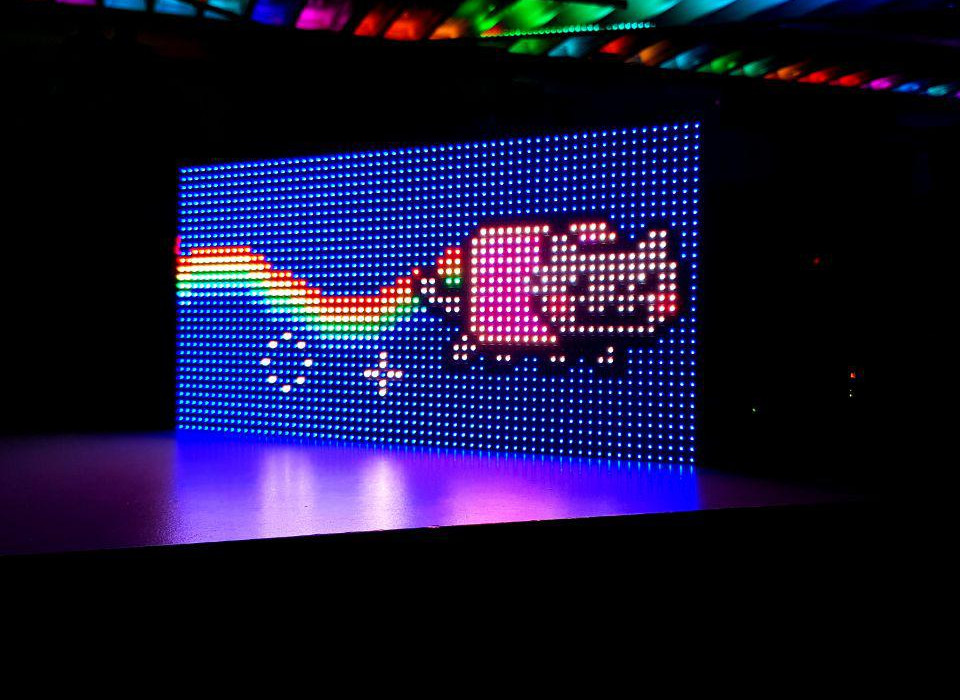

HUB75
=====



Ledcat supports an interface loosely dubbed "HUB75", an interface used in cheap
[LED-pannels such as these](https://www.aliexpress.com/store/product/Indoor-P5-Two-Modules-In-One-1-16-Scan-SMD3528-3in1-RGB-Full-color-LED-display/314096_1610954433.html).

## Setup
To drive a single hub75 display:
1. Get yourself a Raspberry PI, Orange PI or other mini-computer named after a
   fruit.
2. Look up which physical pins have GPIO functionality in the manual of the
   mini-computer, these pins are typically named `PA1`, `PA2`, `PAn`.
3. Connect the LED-panel to the boards GPIO pins. For each pin, note down the
   GPIO-portnumber (the PA-number) corresponding to the label of on the display.
4. Tell ledcat which pin is connected to what by setting the appropriate flags:
   * The `A`, `B`, `C`, etc. pins should be configured using `--level-select`,
     e.g. `--level-select 11,12,13,14`.
   * `R1`, `G1`, `B1`, etc. pins should be configured using the `--red`,
     `--green` and `--blue` flags respectively.
   * Configure the `CLK` with `--clock`, `LAT` with `--latch` and `OE` with `--output-enable`

You should end up with a command that looks something like:
```sh
ledcat --geometry 64x32 hub75 \
    --level-select 11,12,13,14 \
    --red 20,10 --green 9,8 --blue 7,19 \
    --clock 18 --latch 21 --output-enable 2
```

### Tweaking
#### PWM
You can optionally use `--pwm NUM` to control the number of PWM cycles per
screen refresh. A higher value will increase the perceived color depth a the
cost of refresh speed.

## Multiple Displays
There are two approaches to driving multiple display segments:

### In Series
Of the two methods described in this document, this is the simplest as it is
synonymous to simply extending the rows further out. The main drawback of this
method is that it takes longer to complete a single refresh cycle.

To use this method:
1. Join the segments together with a flat-cable. The headers are typically
   labelled as `JIN1` and `JOUT1`.
2. Update the geometry setting, e.g. joining two 32x32 panels requires the
   geometry to be set to 64x32.

__Note:__ While it is perfectly possible to physically place the displays on
top of each other, ledcat currently lacks the transposition to correct the
input to this configuration.

### In Parallel
Displays can also be extended by connecting them in a parallel fashion:
1. Connect the `R`, `G` and `B` pins to the GPIO-pins of the computer and
   append the pin numbers to the `--red`, `--green` and `--blue` flags.
2. Connect the level-select (`A`, `B`, `C`, etc), `LAT`, `CLK` and `OE` pins to
   the existing wires.

Although this setup requires more effort, it should in theory result in a higher refresh-rate.
